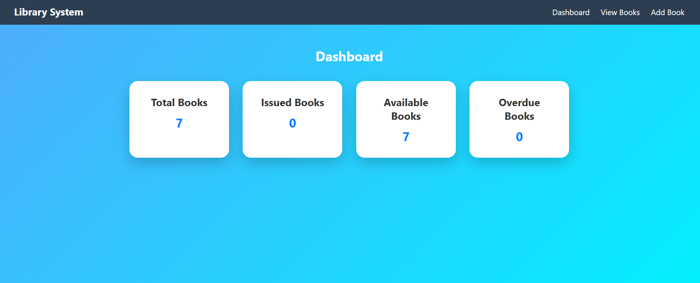
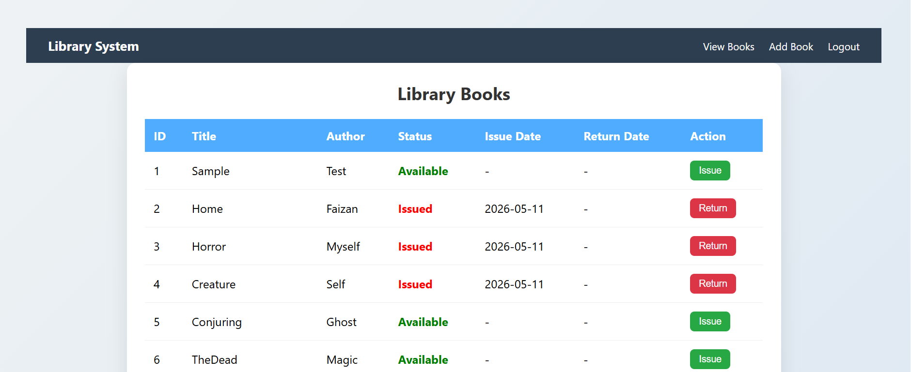

# Library Management System

A full stack Library Management System built using Java, JSP, Servlets, JDBC and MySQL.

---

## Features

- Librarian Login Authentication
- Add Books
- Update Books
- Delete Books
- View Books
- Issue Books
- Return Books
- Session Handling
- MySQL Database Integration

---

## Screenshots

### Login Page

### Dashboard

### Add Books

### 

---

## Technologies Used

### Frontend
- HTML
- CSS
- JavaScript
- JSP

### Backend
- Java
- Servlets
- JDBC

### Database
- MySQL

---

## Tools Used

- Eclipse IDE
- Apache Tomcat
- MySQL Workbench

---

## Database Setup

1. Open MySQL Workbench
2. Create a database named 'library'
3. Import 'library_management.sql'
4. Configure JDBC connection
5. Run project on Tomcat Server

---

## Author

Syed Faizan